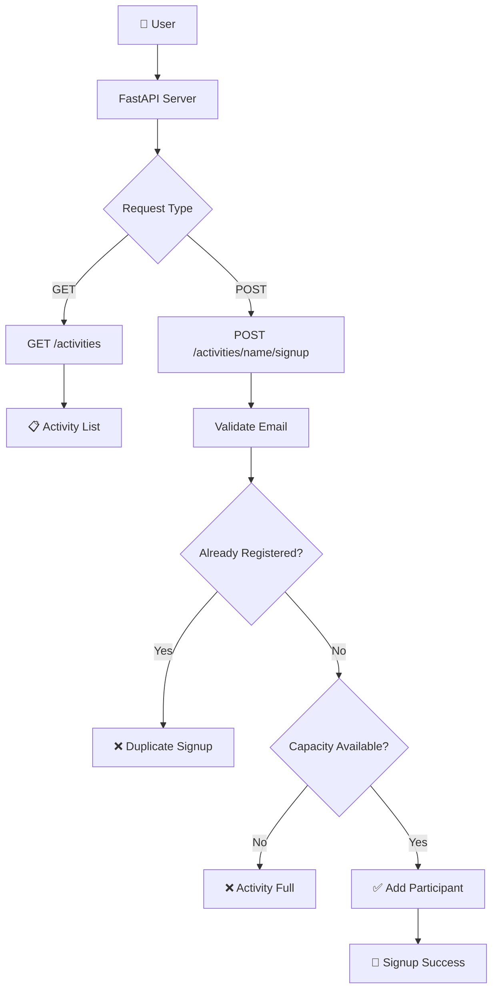

# 🤖 GitHub Copilot × FastAPI

<p align="center">
  <strong>A hands-on GitHub Copilot project for building a simple FastAPI Activity Signup API.</strong>
</p>

<p align="center">


</p>

---

## 🎥 Demo

<p align="center">

<!-- Replace with your demo GIF/video -->
<a href="YOUR_VIDEO_LINK">
  
</a>

</p>

## ⚡ Project

A simple **FastAPI-based Activities API** where users can:

- 📋 View available activities
- 📝 Sign up for an activity
- ✅ Validate email
- 🚫 Prevent duplicate signup
- 👥 Check activity capacity

All data is stored **in memory**.

## 🔄 Flow



## 🏗️ Architecture

```text
            ┌─────────────────────┐
            │       User          │
            └─────────┬───────────┘
                      │
                      ▼
            ┌─────────────────────┐
            │     FastAPI App     │
            └─────────┬───────────┘
                      │
          ┌───────────┴───────────┐
          ▼                       ▼
   GET /activities      POST /activities/{name}/signup
          │                       │
          ▼                       ▼
   Activity Data           Validation Logic
                                  │
                    ┌─────────────┼─────────────┐
                    ▼             ▼             ▼
                  Email        Capacity      Duplicate
                  Check          Check          Check
                    │             │             │
                    └─────────────┴─────────────┘
                                  │
                                  ▼
                         ✅ Signup Response
```

## 🧠 API

| Method | Endpoint | Purpose |
|---|---|---|
| `GET` | `/activities` | List activities |
| `POST` | `/activities/{activity_name}/signup` | Register student |

## 🛠️ Stack

```text
Python
FastAPI
Uvicorn
GitHub Copilot
GitHub Actions
In-Memory Data
```

## 📁 Structure

```text
skills-getting-started-with-github-copilot/
│
├── .devcontainer/
├── .github/
├── .vscode/
├── docs/
├── src/
│   ├── app.py
│   └── README.md
│
├── requirements.txt
├── LICENSE
└── README.md
```

## 🚀 Run

```bash
pip install -r requirements.txt
cd src
python app.py
```

Open:

```text
http://localhost:8000/docs
```

## 🤖 Copilot Learning

This project demonstrates how GitHub Copilot can help with:

```text
Prompt
  ↓
Code Generation
  ↓
API Logic
  ↓
Validation
  ↓
Testing
  ↓
Working FastAPI App
```

## 🎯 Highlights

**FastAPI • GitHub Copilot • REST API • Validation • API Documentation • GitHub Actions**

---

<p align="center">

### 💻 Built with GitHub Copilot + FastAPI

**Learn → Build → Test → Improve**

</p>
